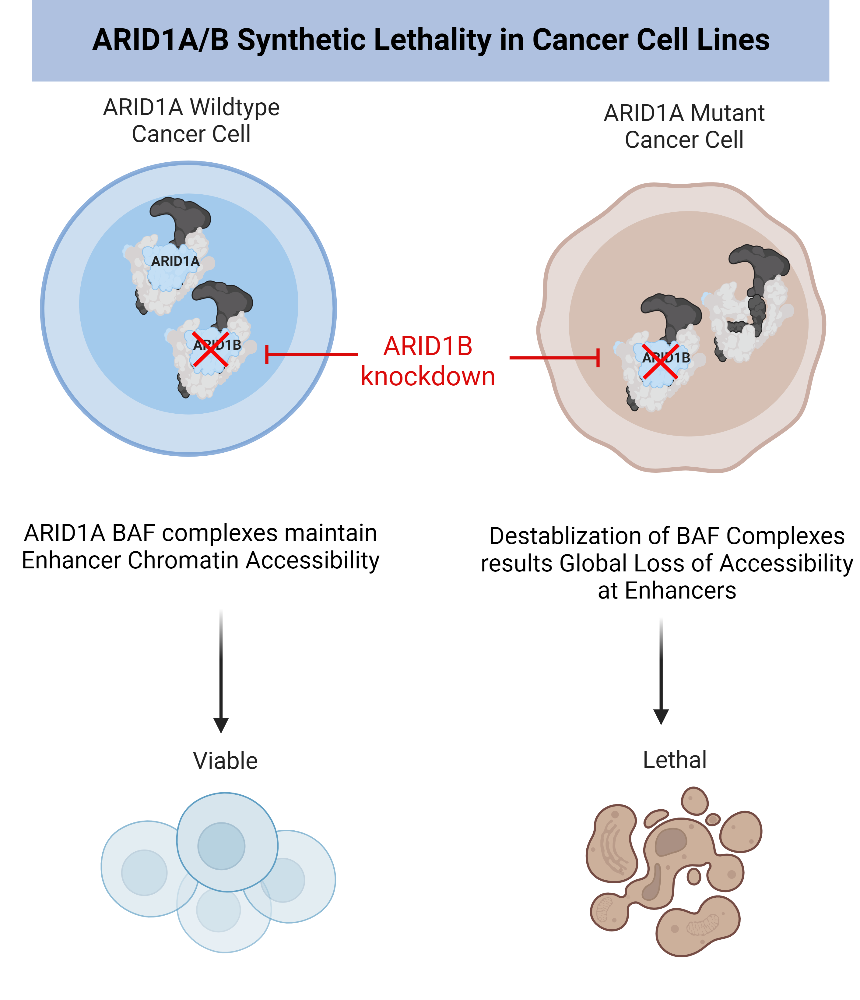

<style>
.tocify {
  font-size: 11pt;
}

.tocify-header .tocify-item {
  font-size: 0.90em;
  padding-left: 25px;
  text-indent: 0;
}

.tocify .list-group-item {
@@ -358,7 +359,6 @@
}
.tocify-subheader .tocify-item {
  font-size: 0.95em;
}
$endif$

p.caption {
  font-size: 1.25em;
  color: black
}

pre {
  overflow-x: scroll
}

pre code {
  white-space: pre;
}

body {
  font-size: 12pt;
}

</style>

```{r setup, include=FALSE}
knitr::opts_chunk$set(echo = TRUE)
knitr::opts_chunk$set(warning = FALSE)
knitr::opts_chunk$set(message = FALSE)
```

### **Load required R packages**
Install R Package called [Pacman](http://trinker.github.io/pacman/vignettes/Introduction_to_pacman.html) and use Pacman to load R packages used for this project. For a description of what each package is used for, I've included a description to the right of each package call within pacman's p_load function!
```{r}
if (!require("pacman")) install.packages("pacman")
pacman::p_load(here,  
               depmap, #package to load depmap data
               ExperimentHub, #Use together with depmap package to pull data
               tidyverse, #dyplyr and ggplot utilities
               ggrepel, # Optimize plot label separation 
               forcats, #Package for working with factors
               msigdbr, #Molecular signatures database package 
               clusterProfiler, #Package for ORA analysis
               org.Hs.eg.db, #human genome annotations
               ReactomePA) #Reactome pathways package for ORA analysis

```


### **Pull DepMap RNAi Data**
Here I use the [ExperimentHub](https://bioconductor.org/packages/release/bioc/html/ExperimentHub.html) and [DepMap](https://bioconductor.org/packages/release/data/experiment/vignettes/depmap/inst/doc/depmap.html) R packages to load in the RNA interference (RNAi) DepMap dataset to analyze the specific genetic dependencies of ARID1A mutant cancer cell lines. Analyzing ARID1A mutant genetic dependencies allows for both target identification of proteins that may be therapeutically actionable in ARID1A mutant cancers and can be a powerful discovery tool in giving hints towards novel biological processes which ARID1A plays a role! 

```{r}
## create ExperimentHub query object for DepMap data
eh <- ExperimentHub()
query(eh, "depmap")

#Grab genetic dependency data from RNAi DepMap dataset
gd <- depmap::depmap_rnai()

#Data from this dataset includes 17634 genes screened, 558 cell lines, 26 primary diseases, 28 lineages.
metadata <- depmap::depmap_metadata()

#mutation data for all genes in DepMap
mutationCalls <- depmap::depmap_mutationCalls()

###ARID1A_mutant depmap id, all of DepMap
ARID1A_mutant <- as.data.frame(mutationCalls[mutationCalls$gene_name=="ARID1A",])
head(ARID1A_mutant)
###ARID1A_mutant depmap id, all of Depmap
length(unique(ARID1A_mutant$depmap_id)) #269 ARID1A mutant cell lines in all of DepMap

#Metadata has cell lines with ARID1A mutation
ARID1A_metadata <- as.data.frame(metadata[metadata$depmap_id %in% ARID1A_mutant$depmap_id,])
dim(ARID1A_metadata)
head(ARID1A_metadata)
length(unique(ARID1A_metadata$depmap_id)) #269 ARID1A mutant cell lines in all of DepMap
ARID1A_mutant_cancer_lines <- unique(ARID1A_metadata$depmap_id)

```


### **Classify ARID1A Mutant vs Non-Mutant**
Here I pull the list of ARID1A mutant and non-mutant cell lines in the RNAi DepMap dataset, label them as "mutant" or "nonmutant" in a new column called group, and then make a dataframe comprising both groups for a for loop to do some calculations. First, we calculate the effect size which is the difference of dependency scores for each gene following RNAi knockdown between ARID1A mutant and non-mutant cancer cell lines as well as to calculate the log10p values for significance.
```{r}
#Pull the ARID1A mutant cell lines in RNAi-GENETIC dependencies screen
ARID1A_rnai <- as.data.frame(gd[gd$depmap_id %in% unique(ARID1A_mutant$depmap_id),])
head(ARID1A_rnai)
length(unique(ARID1A_rnai$cell_line)) #122 ARID1A mutant cell lines in RNAi dataset
length(unique(ARID1A_rnai$depmap_id)) 


######ARID1A Mutant RNAi genetics dependancies including all 122 cell lines
#Huge dataframe, could mine it for understanding heterogeneity in genetic deps but we'll just look at averages for now
ARID1A_rnai <- as.data.frame(gd[gd$depmap_id %in% unique(ARID1A_mutant$depmap_id),])
length(unique(ARID1A_rnai$cell_line))
head(ARID1A_rnai)

#non_mut is non-mutant
#Save non-mutants to a dataframe non_mut based on excluding the ARID1A mutant depmap_ids from gd object
non_mut <- as.data.frame(gd[!gd$depmap_id %in% unique(ARID1A_mutant$depmap_id),])
ARID1A_rnai$group<-"mutant"
non_mut$group<- "nonmutant"
head(non_mut)

#Combine ARID1A mutant & non-mutant cell lines to run a for loop on
testdat<-rbind(ARID1A_rnai,non_mut)

#For statistical significance (log10p) and effect size (es), initialize a matrix object for our for loop to fill
log10p <- c()
diff_means <- c()
es <- c()
Gene<-na.omit(unique(ARID1A_rnai$gene_name))
length(Gene) #17309 is the number of genes targeted in RNAi DepMap project

```

### **Calculate effect size & significance**
**NOTE: This for loop takes a very long time to run on a local machine so best to run this command in R on a high performance computing cluster!** 
```{r eval=FALSE}

for (i in 1:length(Gene)) {
   ARID1A_mut <- ARID1A_rnai[which(ARID1A_rnai$gene_name==Gene[i]),]
   head(ARID1A_mut)
   length(unique(ARID1A_mut$cell_line))

   temp <- non_mut[which(non_mut$gene_name==Gene[i]),]

   wt <- t.test(ARID1A_mut$dependency,
                temp$dependency)
   log10p[i] <- -log10(wt$p.value)
   diff_means[i] <- mean(ARID1A_mut$dependency,na.rm=T) - mean(non_mut$dependency, na.rm =T)
   es[i] <- diff_means / sd(non_mut$dependency, na.rm = T)
 }

 #Make dataframe combining gene name (Gene), with effect size (es) which is the difference of means in dependency scores, and log10p (log10p)
 dat<-cbind(Gene,log10p,es)
 head(dat)
 dat<-as.data.frame(dat)
 dat$log10p<- as.numeric(dat$log10p)
 dat$es<- as.numeric(dat$es)
 #Output the results
 write.table(dat, "ARID1_mutant_rnai_effect_size.txt",quote=F,sep="\t")

```


### **Volcano plot for ARID1A Mutant Genetic Dependencies**
Here I plot the effect size and significance values for ~17,000 genes in the RNAi screens that this DepMap data was generated from. For the cutoffs that I defined here there are about 102 genes that are are genetic dependencies in ARID1A mutant cancers classified by their dropout in the RNAi screens differentially in ARID1A mutant cancer cell lines compared to non-mutant cancer cell lines. **As a positive control to make sure this analysis is giving reasonable results, I highlight that the paralog of ARID1A, ARID1B is the most significant dependency in ARID1A mutant cancer cell lines.**
```{r volcano_plot, fig.cap = "**Figure 1: Volcano Plot of ARID1A Mutant Cancer Genetic Dependencies**", fig.height=6, message=FALSE}
#Read in data from the previous code chunk run on high performance computing cluster
wd <- r"(C:\Users\mattm\OneDrive\Desktop\GitHub_projects\DepMap\vetting_code)"
setwd(wd)
dat <- read.delim("RNAi_ARID1A_Sensitivity_DepMap.txt")

#Add a new column using dplyr package defining genes as 
# 1) Not significant (NS)
# 2) ARID1A mutant dependency (ARID1A mutant is sensitive to gene knockdown)
# 3) or a non-mutant dependency (ARID1A mutant is resistant to gene knockdown)
new_dat <- dat %>%
  mutate(gene_type = case_when(log10p >= 2 & es <= -0.125 ~ "ARID1A_Mutant_Dependency",
                               log10p >= 2 & es >= 0.125 ~ "Non-mutant_Dependency",
                               TRUE ~ "NS"))

#Specify colors, sizes, and transparancy values associated with the three classes of genes for volcano plot
cols <- c("ARID1A_Mutant_Dependency" = "red", "Non-mutant_Dependency" = "#26b3ff", "NS" = "grey")
sizes <- c("ARID1A_Mutant_Dependency" = 2, "Non-mutant_Dependency" = 2, "NS" = 1) 

#Genes for labeling on volcano plot
label_genes <- new_dat %>%
  filter(Gene %in% "ARID1B")


#Output plot of effect size vs Log10P value
volcano_deps <- ggplot(new_dat, aes(es, log10p)) + 
      geom_point(aes(colour = gene_type),
             alpha = .6,
             shape = 16,
             size = 4) + 
  geom_hline(yintercept = 2, linetype = "dashed") +
  geom_vline(xintercept = c(-0.12, 0.125),
             linetype = "dashed") +
  geom_label_repel(data = label_genes,
                   aes(label = Gene),
                   force = 3,
                   nudge_y = 1.5) +
  scale_colour_manual(values = cols) + 
  ggtitle(substitute(paste(bold("ARID1A Mutant Cancer Genetic Dependencies (RNAi)")))) +
  labs(x = "Difference of Mean Depenency", y = "-Log10 p-value", colour = "Legend") +
  theme_classic() +
  theme(plot.title = element_text(hjust = 0.5, size = 15)) +
  theme(axis.text = element_text(size = 10, color = "black"), axis.title.x = element_text(size = 14), axis.title.y = element_text(size = 14))

volcano_deps
```


### **ARID1A Mutant Synthetic Lethality with ARID1B Knockdown**
To give context to the result I highlighted above showing ARID1B is the gene whose knockdown is the most significant dependency in ARID1A mutant cancers, I'm including a graphic below to give some context into why ARID1A mutant cancers display an enhanced sensitization to knockdown of the ARID1A paralog, ARID1B compared to cancers in which ARID1A is not mutated. For more info on the ARID1 synthetic lethal relationship, see the following publications from the Hargreaves Lab, [Kelso et al](https://elifesciences.org/articles/30506) and the Roberts Lab, [Helming et al](https://www.nature.com/articles/nm.3480). 
```{r echo=FALSE, out.width = "100%", fig.align = "center"}
wd <- r"(C:\Users\mattm\OneDrive\Desktop\GitHub_projects\DepMap)"
setwd(wd)


# C:\Users\mattm\OneDrive\Desktop\GitHub_projects\DepMap
# ARID1A_B_Synthetic_Lethality_Graphic```


```


### **Over-Representation Analysis (ORA) of ARID1A Mutant Dependencies**
To get an idea of the biological pathways that are specifically enriched within the 102 ARID1A mutant genetic dependency genes I defined, I can perform ORA analysis against the Reactome Pathways datasets using the [ReactomePA](https://bioc.ism.ac.jp/packages/3.11/bioc/vignettes/ReactomePA/inst/doc/ReactomePA.html) package. This analysis is useful as it can highlight specific pathways or biological processes that are differentially required in ARID1A mutant cancers which could be promising drug targets in ARID1A mutant cancers. 
```{r ORA_analysis, fig.cap = "**Figure 2: ORA Analysis of ARID1A Mutant Cancer Genetic Dependencies**", fig.height=5.5, message=FALSE}
#Grab the genes we categorized as ARID1A dependencies (n=102) using dplyr filter function
ARID1A_Deps <- new_dat %>%
  filter(gene_type %in% "ARID1A_Mutant_Dependency")

#Need to grab just the gene name column for Gene Symbol to Entrez ID conversion
ARID1A_Deps <- ARID1A_Deps$Gene

#Add Entrez IDs to Gene IDs df using bitr function from ClusterProfiler package
Entrez_ID <- bitr(ARID1A_Deps, fromType="SYMBOL", toType="ENTREZID", OrgDb="org.Hs.eg.db")

#Make Entrez IDs into a matrix for the enrichpathway command
de <- Entrez_ID$ENTREZID

#Need to get gene overlap with datasets and significance value w Reactome datasets
#enrichPathway function is from the ReactomePA package
x <- enrichPathway(gene = de, pvalueCutoff = 0.05, readable = TRUE, maxGSSize = 1500, minGSSize = 5)
head(x)

#Grab enrichPathway results from our S4 results object.
ReactomePathways <- x@result

#Function to convert fractions to decimals
convert_fraction_to_proportion <- function(fraction) {
  fraction_parts <- strsplit(fraction, "/")[[1]]
  numerator <- as.numeric(fraction_parts[1])
  denominator <- as.numeric(fraction_parts[2])
  
  proportion <- numerator / denominator
  return(proportion)
}

#Convert fractions in GeneRatio column to decimal proportions
ReactomePathways$GeneRatio <- apply(ReactomePathways, 1, function(row) convert_fraction_to_proportion(row["GeneRatio"]))

#Remove duplicate Reactome entries in the description column
ReactomePathways <- ReactomePathways[!duplicated(ReactomePathways$Description), ]
ReactomePathways <- ReactomePathways[!duplicated(ReactomePathways$Description), , drop = FALSE]

#Grab the top pathways in ORA Reactome
Top_pathways <- slice_max(ReactomePathways, order_by = GeneRatio, n=10)
rownames(Top_pathways) <- Top_pathways$Description

#select non-redundant top reactome pathways
Top_pathways <- Top_pathways %>%
  filter(row.names(.) %in% c("Metabolism of RNA", "RNA Polymerase II Transcription",
                             "rRNA processing", "mRNA Splicing", "Processing of Capped Intron-Containing Pre-mRNA"))

#Make Reactome Enrichments plot
custom_dotplot <- ggplot(Top_pathways, aes(x = GeneRatio, y = fct_reorder(Description, GeneRatio))) + 
  geom_point(aes(size = GeneRatio, color = p.adjust)) +
  theme_minimal(base_size = 14) +
  #scale_colour_viridis_c(limits = c(5.0e-06, 2.5e-05). direction = 1, option = "viridis")+
  ylab(NULL) +
  #ggtitle("Hallmark enrichment", ) +
   scale_colour_gradient(limits=c(7.553705e-15, 0.04), low="red", high = "blue")  + coord_cartesian(clip = "off") +
   scale_size_continuous(range = c(5, 15)) +
  labs(color="adjusted p-value", size="beneRatio") + 
  ggtitle(substitute(paste(bold("ORA, ARID1A Mut Deps")))) +
  theme(axis.text=element_text(size=10,color="black")) +
    theme(plot.title = element_text(hjust = 0.5, size = 15)) 
custom_dotplot
```

### **Are ARID1A Mutant Cancers Synthetic Lethal with R-Loop Regulators?**
The above ORA analysis reveals a prominent enrichment of biological processes related to RNA Metabolism, Transcription, and RNA Splicing. Many of these genes represented by these RNA metabolism and processing pathways (splicing factors, helicases, etc) are involved in the resolution of RNA:DNA hybrid structures called "R-Loops" formed during transcription-DNA replication conflicts which can result in genotoxic double stranded breaks and apoptosis if unresolved. 
```{r echo=FALSE, out.width = "100%", fig.align = "center"}

# C:\Users\mattm\OneDrive\Desktop\GitHub_projects\DepMap
# ARID1A_B_Synthetic_Lethality_Graphic```


```
In my doctoral research, I discovered that ARID1A mutant cancers show an increase in R-Loops but these R-Loops appear to be resolved before any double stranded breaks and apoptosis occur. **An interesting hypothesis generated from this DepMap analysis and my thesis research findings is that ARID1A mutant cancers are differentially dependent on R-Loop processing factors given their increased R-Loop burden.**. If this were indeed true, one might imagine that R Loop processing factors would be over-represented within the 102 ARID1A mutant dependency genes. We can test this by using a Fisher's exact test test below.

### **Enrichment of R-Loop Regulators among ARID1A Mutant Deps**
To test if R-Loop regulator genes are over-represented among the 102 ARID1A mutant dependency genes, first I'll load in a list of putative R-Loop regulator genes from a recent publication that published the first comprehensive list of putative R-Loop regulator/interactor proteins called [R-Loop Base](https://academic.oup.com/nar/article/50/D1/D303/6430826). 
  I can then use dplyr package to annotate whether each gene in our dataset is an R-Loop regulator or not followed by getting their counts in the ARID1A mutant dependency or not dependency classes of genes. These metrics will be our input for the Fisher's Exact Test to evaluate for over-representation in ARID1A mutant deps (n=102) vs a background list of Non-Deps (n=17,207). The fisher.test function to perform the test is included in base R so no need to install a package to run the test.
```{r Fisher T test, fig.cap = "**Figure 3: Fisher's Test for OverRepresentation of R-Loop Regulators among ARID1A Mutant Dependencies**", fig.height=8}

#Read in R-Loop genes list
#This list is from R-Loop Base publication.
r_loop_human_genes <- read.delim("human_R_loop_regulators.txt")

#Add a new column using dplyr mutate function to classify genes as R-Loop regulators or not using dplyr mutate function
new_dat <- new_dat %>%
  mutate(gene_class = case_when(new_dat$Gene %in% r_loop_human_genes$Gene ~ "R-loop regulator",
                                #new_dat$Gene %in% BAF$Human_gene ~ "SWI-SNF subunit", 
                                #new_dat$Gene %in% IFN_related_genes$Gene ~ "IFN-related",
                                TRUE ~ "Non R-loop regulator"))

#Filter for ARID1A Mutant Deps containing the gene_class column using dplyr filter function
ARID1A_Deps <- new_dat %>%
  filter(gene_type %in% c("ARID1A_Mutant_Dependency"))

#Filter for Non-Mutant Deps using dplyr filter function
non_deps <- new_dat %>%
  filter(gene_type %in% c("NS", "Non-mutant_Dependency"))

#Make gene_class a factor rather than a character for subsequent count function (can't count characters)
ARID1A_Deps$gene_class <- as.factor(ARID1A_Deps$gene_class)

#Count number of R-Loop regulators in ARID1A Deps
ARID1A_dep_counts <- ARID1A_Deps %>%
  count(gene_class) %>%
  arrange(desc(n)) %>%
  mutate(Fraction_of_dataset = n/sum(n))

#Count number of R-Loop regulators in Non-mutant Deps
Non_significant_counts <- non_deps %>%
  count(gene_class) %>%
  arrange(desc(n)) %>%
  mutate(Fraction_of_dataset = n/sum(n))


# Set the factor levels in the desired order
ARID1A_dep_counts$gene_class <- factor(ARID1A_dep_counts$gene_class, levels = unique(ARID1A_dep_counts$gene_class))  

Non_significant_counts <- non_deps %>%
  count(gene_class) %>%
  arrange(desc(n)) %>%
  mutate(Fraction_of_dataset = n/sum(n))

#Make data frame for statistical tests
test_dat <- data.frame(Group = c("ARID1A Mutant Dependencies", "Non Dependency"),
                   R_loop_regulator = c(32, 1025),
                   non_r_loop = c(70, 16182))

# Perform the Fisher's exact test
fisher_result <- fisher.test(test_dat[, c("R_loop_regulator", "non_r_loop")])
fisher_result


# Set the factor levels in the desired order
Non_significant_counts$gene_class <- factor(Non_significant_counts$gene_class, levels = unique(Non_significant_counts$gene_class))  

barplot_dat <- data.frame(
  group = rep(c("ARID1A Mutant Dependencies", "Non Dependency"), each = 2),
  Legend = rep(c("R-loop regulators", "Non R-loop regulators"), times = 2),
  proportion = c(0.3137255, 0.6862745, 0.05956878, 0.94043122)
)

barplot <- ggplot(barplot_dat, aes(x = group, y = proportion, fill = Legend)) +
  geom_bar(stat = "identity", position = "stack") +
  scale_fill_manual(values = c("black", "red")) +
  coord_cartesian(clip = "off") +
  theme_minimal(base_size = 15) +
  ylab("Proportion of group") +
  xlab(NULL) +
  ggtitle(substitute(paste(bold("Fisher Test for R-Loop Regulators")))) +
  theme_classic() +
  theme(axis.title.y = element_text(size = 14)) +
  theme(axis.text = element_text(size = 12, color = "black")) +
  theme(axis.text.x = element_text(size = 12, angle = 45, hjust = 1)) 

# Annotate with p-value centered between the two bars
#x=1.5 is middle of the plot and y=1.1 is just above the highest value of 1.0
p_value <- 4.3e-15 
barplot + 
  annotate("text", x = 1.5, y = 1.1, label = paste("p =", p_value), size =7)

```
Very interesting results! In the 102 ARID1A mutant dependency genes, over 30% of these genes are annotated as R-Loop regulators compared to just 5% of the Non Depedency genes. This gives us a ~6 fold enrichment with a highly significant p-value from our Fisher's Exact Test! I believe the hypothesis that targeting R-Loop regulators in ARID1A mutant cancers to exploit a specific dependency in those tumors is an interesting direction for future research and would provide for an unmet clinical need as ARID1A mutant tumors currently have no FDA approved targeted therapeutics. **This is a fine example of how computational biology analyses and public omics datasets can drive efficiently drive discovery and give rise to exciting new therapeutic directions! :)**
